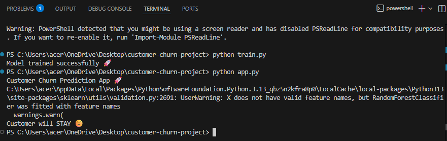

# 📊 Customer Churn Prediction

## 🧠 Project Overview
This project predicts whether a customer will leave (churn) or stay using Machine Learning techniques.  
Built using Python and Scikit-learn with a real telecom dataset.

---

## 🚀 Features
- Data preprocessing and cleaning
- Label encoding for categorical data
- Random Forest Classifier model
- Customer churn prediction

---

## 📂 Dataset
Telco Customer Churn Dataset  
(Source: Kaggle)

---

## 🛠️ Tech Stack
- Python  
- Pandas  
- NumPy  
- Scikit-learn  
- Machine Learning (Random Forest)

👨‍💻 Author
Arun Kumar T

## 📸 Output Screenshot

